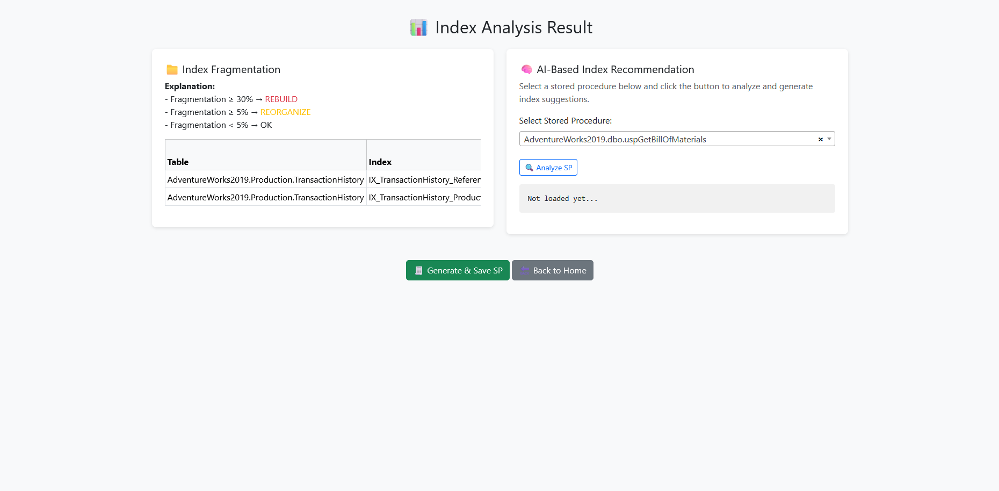
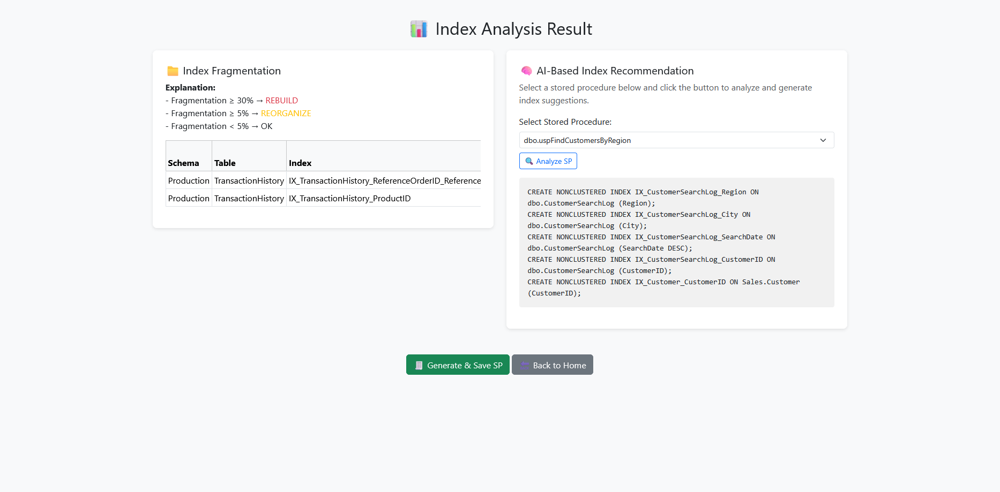
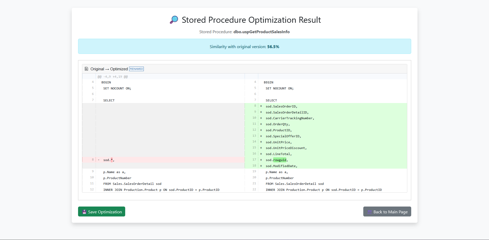
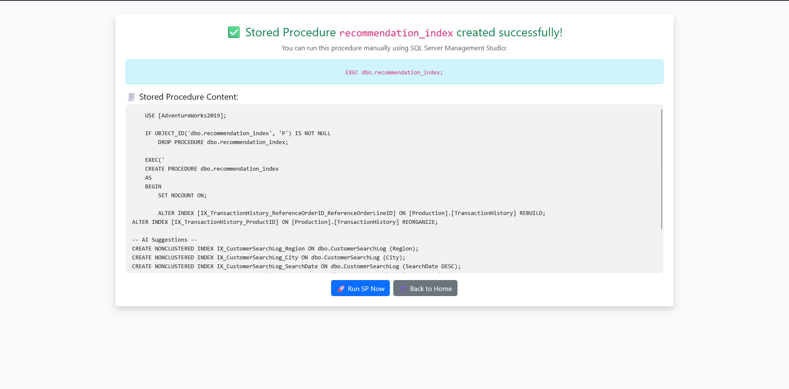
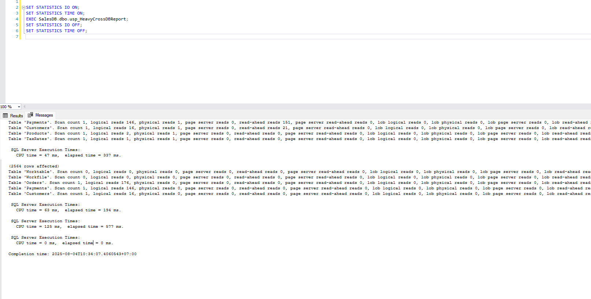
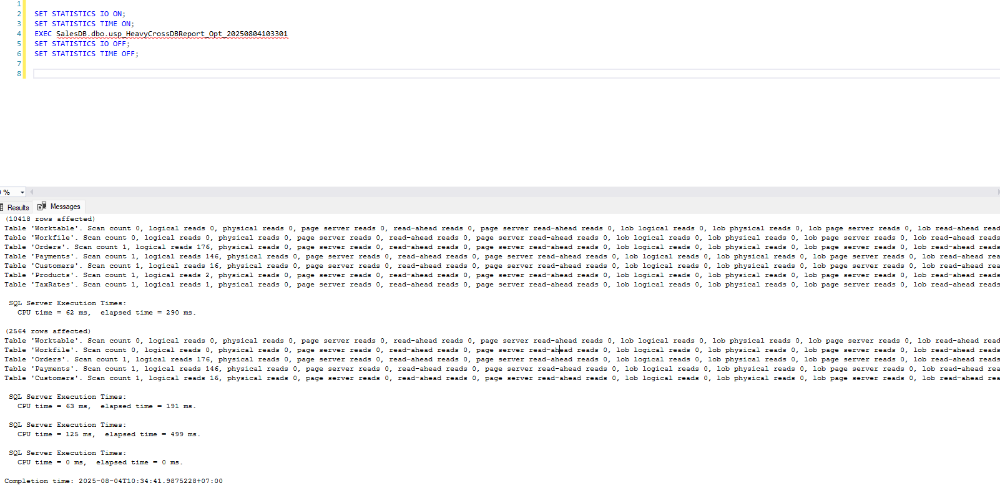

# 🧠 SQL Server Performance Optimizer (Prototype)

A Flask-based prototype application to help analyze and optimize SQL Server performance.
It can scan multiple databases, detect index fragmentation, analyze stored procedures, and generate AI-based optimization suggestions.

## 🎯 Why This Project Matters

This tool demonstrates how AI can complement traditional DBA workflows by:

- Reducing query execution time
- Highlighting fragmented indexes across all databases
- Suggesting indexes based on stored procedure usage
- Helping developers avoid time-consuming manual optimization

---

## 🧰 Tech Stack

- Python 3.x
- Flask
- SQL Server (tested with 2019)
- Gemini (via API)
- Jinja2 Templates
- HTML / Bootstrap

---

## 🚀 Key Features

- 🔍 Detect fragmented indexes across **multiple databases**
- 🧠 AI-based index recommendations using:
  - Stored procedure content
  - Table columns
  - Existing index metadata
- 📜 Consolidate recommendations into a single stored procedure: `recommendation_index` that saved patent on TestDB
- ⚙️ Stored procedure optimization with side-by-side comparison
- 📈 Detect slow stored procedures via SQL Server DMVs
- 🗂 Save recommendations to `.sql`, `.json`, and a log table

---

## New (2025) Improvements

- Support for **multi-database stored procedures** (cross-database joins)
- Improved table extraction from stored procedure text:
  - Auto-detects `db.schema.table`, `schema.table`, and bare `table`
  - Auto-expands schema and database if missing
- Pulls **table column metadata and existing indexes** from all involved databases
- **Select2-powered stored procedure picker** for quick searching in the UI

---

## 📦 Installation

### 1. Clone the repository

```bash
git clone https://github.com/wahyudirobbysutanto/sp_optimizer_prototype.git
cd sp_optimizer_prototype
```

### 2. Create a virtual environment

```bash
python -m venv venv
```
#### Windows:
```bash
venv\Scripts\activate
```
#### Linux/macOS:
```bash
source venv/bin/activate
```

### 3. Install dependencies
```bash
pip install -r requirements.txt
```

---

## ⚙️ Database Configuration
Create a `.env` file in the root folder:
```bash
SQL_SERVER=localhost
SQL_DATABASE=master
SQL_USERNAME=your_username
SQL_PASSWORD=your_password
```

Replace with your SQL Server credentials.

---

## ▶️ Running the Application
```bash
python run_web.py
```

Open in your browser:
```bash
http://127.0.0.1:5000
```

---

---

## 🧪 Usage Flow

1. **Check Index Fragmentation**  
   Detects indexes needing REBUILD/REORGANIZE across all accessible databases
2. **Select a Stored Procedure**  
   (Now supports `database.schema.procname`)
3. **Analyze with AI**  
   - Recommends indexes based on SP joins and filters
   - Suggests replacing `SELECT *` with explicit columns
4. **Save as Stored Procedure**  
   Creates `TestDB.dbo.recommendation_index` with combined recommendations

---

---

## 📄 Example Output

Sample recommendations:

```sql
ALTER INDEX [IX_TransactionHistory_ReferenceOrderID_ReferenceOrderLineID] ON [AdventureWorks2022].[Production].[TransactionHistory] REBUILD;
ALTER INDEX [IX_TransactionHistory_ProductID] ON [AdventureWorks2022].[Production].[TransactionHistory] REBUILD;
ALTER INDEX [XMLPROPERTY_Person_Demographics] ON [AdventureWorks2022].[Person].[Person] REORGANIZE;
ALTER INDEX [XMLVALUE_Person_Demographics] ON [AdventureWorks2022].[Person].[Person] REORGANIZE;
ALTER INDEX [IX_TransactionHistory_ReferenceOrderID_ReferenceOrderLineID] ON [AdventureWorks2019].[Production].[TransactionHistory] REBUILD;
ALTER INDEX [IX_TransactionHistory_ProductID] ON [AdventureWorks2019].[Production].[TransactionHistory] REBUILD;
ALTER INDEX [PK__DailyPri__8A546FD33D9E534C] ON [swing_trading_new].[dbo].[DailyPrice] REBUILD;
ALTER INDEX [PK__Screenin__3213E83FA640DA6C] ON [swing_trading_new].[dbo].[ScreeningResults_New] REORGANIZE;

-- AI Suggestions --
CREATE NONCLUSTERED INDEX IX_Orders_CustomerID ON SalesDB.dbo.Orders (CustomerID);
CREATE NONCLUSTERED INDEX IX_Orders_ProductID ON SalesDB.dbo.Orders (ProductID);
CREATE NONCLUSTERED INDEX IX_Payments_OrderID ON FinanceDB.dbo.Payments (OrderID);
CREATE NONCLUSTERED INDEX IX_TaxRates_Region ON FinanceDB.dbo.TaxRates (Region);
CREATE NONCLUSTERED INDEX IX_Customers_CustomerName ON SalesDB.dbo.Customers (CustomerName);
CREATE NONCLUSTERED INDEX IX_Payments_PaymentDate ON FinanceDB.dbo.Payments (PaymentDate);
```

---

---

## 🖼️ Demo Screenshots

### Index Fragmentation Results


### AI-based Index Recommendations


### Optimized Stored Procedure View


### Optimized Stored Procedure View


### Compare Optimized Stored Procedure Before and After




## 🗃️ Folder Structure
```bash
├── app/
│   ├── indexing/
│   	├── __init__.py
│   	├── fragmentation_analyzer.py
│   	├── index_ai.py
│   	├── index_recommender.py
│   	├── recommendation_builder.py
│   	└── sql_executor.py
│   ├── optimization/
│   	├── __init__.py
│   	├── sp_loader.py
│   	├── sp_optimizer.py
│   	└── sp_saver.py
│   └── utils/
│   	├── __init__.py
│   	├── logger.py
│   	└── utils.py
|	├── __init__.py
|	├── db_connector.py
|	└── gemini_client.py
├── samples/                            # 📁 Sample SP and outputs
│   ├── CustomerSearchLog.sql        
│   ├── generate_fragmentation.sql       
│   ├── uspFindCustomersByRegion.sql        
│   ├── uspGetOrdersByCustomer.sql        
│   └── uspGetProductSalesInfo.sql       
├── logs/                               # 📁 Sample SP and outputs
│   └── log_activity.json
├── outputs/                            # 📁 AI SQL recommendation files
├── templates/ 
│   ├── execution_result.html
│   ├── index.html
│   ├── index_result.html
│   ├── optimize.html
│   ├── result.html
│   ├── save_result.html
│   ├── slow_sp.html
│   └── save_result_optimize.html
├── run_web.py                   
├── requirements.txt
├── .env                         
└── README.md
```
---

## ⚠️ Notes

- Ensure your SQL Server login has `VIEW DEFINITION` access to all databases you want to scan
- AI suggestions do not change logic; they only:
  - Replace `SELECT *`
  - Suggest better joins
  - Recommend indexes
- Optimized procedures are saved with `_optimized` suffix

---

## 📬 Contact & Feedback

If you have questions, suggestions, or want to collaborate, feel free to reach out:

- 💼 LinkedIn: [Wahyudi Robby Sutanto](https://www.linkedin.com/in/wahyudirs/)
- 📧 Email: wahyudirobbysutanto@gmail.com
- 🐙 GitHub: [@wahyudirobbysutanto](https://github.com/wahyudirobbysutanto)

Feedback and contributions are welcome!


---

## 📜 License
MIT License – Free to use for learning, experimentation, and internal development.
